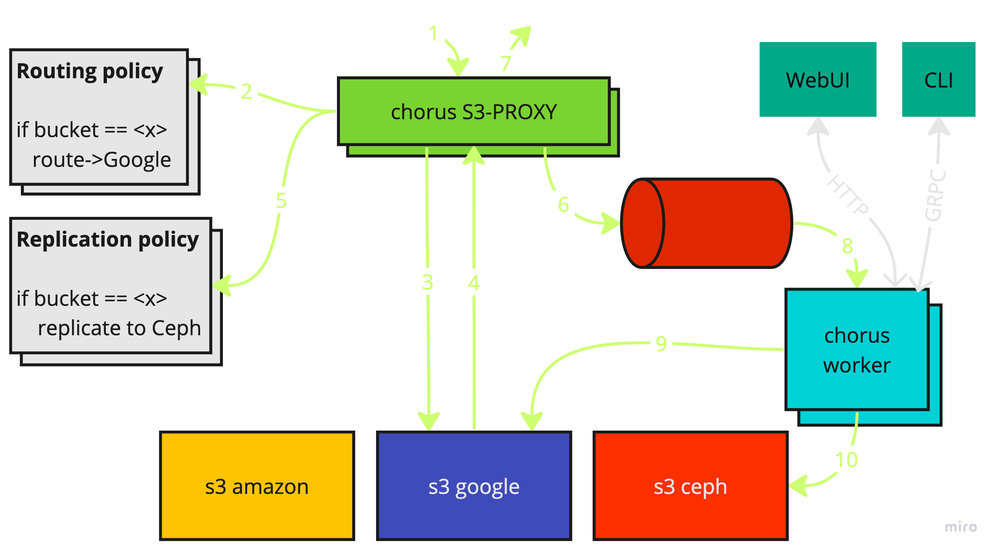

# Chorus


Chorus is vendor-agnostic s3 backup, replication, and routing software. 
Once configured it can:
 - sync existing buckets and objects from source to destination s3 storage
 - capture live bucket/object changes from source s3
 - propagate the changes to destination s3

Listed features can be configured per s3 user and per bucket with [management CLI](./tools/chorctl) or webUI.

## Components
[Chorus S3 Proxy](./service/proxy) service responsible for routing s3 requests and capturing data change events. 
[Chorus Agent](./service/agent) can be used as an alternative solution for capturing events instead of proxy.
[Chorus Worker](./service/worker) service does actual data replication.
Communication between Proxy/Agent and worker is done over work queue. 
[Asynq](https://github.com/hibiken/asynq) with [Redis](https://github.com/redis/redis) is used as a work queue.



For details, see:
- [proxy](./service/proxy)
- [worker](./service/proxy)
- [agent](./service/proxy)
- [standalone](./service/proxy)
- [management CLI](./tools/chorctl)

## Documentation

Documentation available at [docs.clyso.com](https://docs.clyso.com/docs/products/chorus/overview).

## Develop

[test](./test) package contains e2e tests for replications between s3 storages.
It runs:
- 3 embedded [gofakes3](https://github.com/johannesboyne/gofakes3) s3 storages
- embedded redis [miniredis](https://github.com/alicebob/miniredis)
- worker and proxy service

all listed tools are written in go so test can be run without external dependencies just by:
```shell
go test ./test/...
```
